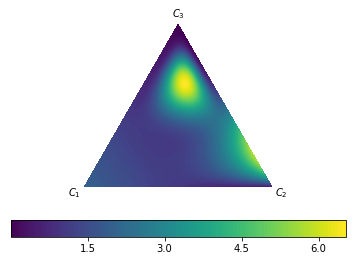

*Paper*: **Beyond temperature scaling: Obtaining well-calibrated
multiclass probabilities with Dirichlet calibration**\
*Authors: Meelis Kull, Miquel Perello-Nieto, Markus Kängsepp, Telmo
Silva Filho, Hao Song, Peter Flach\
Published:* 2019-10-28, NeurIPS 2019*\
Label:* Calibration (WP2)

**Theory** (type of innovation, improving X, task(s) description, uniqueness)
-----------------------------------------------------------------------------

Native (not pairwise / one-vs-rest) general-purpose (non-NN and NN)
multi-class *post-hoc* calibration with Dirichlet calibration maps as an
extension of Beta calibration (binary); focus on class-wise calibration,
not only confidence calibration (argmax).

Propose new metric for class-wise calibration evaluation and
visualization.\
Introduce Dirichlet calibration maps for increased interpretability of
calibration effect.\
Secret sauce might be ODIR regularization (enables calibration for
larger K classes output space).

Task: multiclass (image) classification; similar approaches:
temperature, vector, matrix scaling.

Uniqueness: extension on beta calibration, results improve slightly
improve temperature scaling, mainly impact on class-wise calibration,
less so for confidence-calibration.

Methodology (support for claims, dataset, evaluation metrics): 
---------------------------------------------------------------

*UCI benchmark dataset and CIFAR-10/100. *

Extensive experimentation which is overall extremely well-documented
with a large appendix section.\
Large comparison to a range of calibration, loss metrics.\
Very nice statistical rank comparisons with Friedman tests and post-hoc
Bonferonni-Dunn test to explain effect size in terms of “Critical (rank)
Difference” over repeated measurements.\
Additional perfect calibration statistical test.

\
**Open-source** material (code, dataset, tutorial, references): 
----------------------------------------------------------------

[*https://github.com/dirichletcal/experiments\_neurips*](https://github.com/dirichletcal/experiments_neurips)\
[*https://github.com/dirichletcal/experiments\_dnn*]()

\
Usefulness\
(task \[classification, extraction, …\], part-of-pipeline, extension / improvement on, domain/use-case):
--------------------------------------------------------------------------------------------------------

*My two cents:* Better global thresholding with class-wise calibration;
perception: K=2 ranking score: making an error where the second-best
answer is almost equally probable is less a false positive than when
being less confident.

General-purpose:

-   General: fit small NN model taking in pickled val/test logits.

-   NNs: replaces the softmax/tempscale layer with \[logistic
    regression + feedforward + softmax\].

Lovely visualization and interpretability:

{width="2.3756944444444446in"
height="1.7416666666666667in"}

**Feasability\
**(short-term/long-term | nice-to-have, complexity / far-from-practice?)
------------------------------------------------------------------------

Code is available, general-purpose method, easy comparison to
temperature scaling.\
Warrants a run on our datasets and models.\
Code is a bit all over the place, yet attached notebooks are very
insightful for ablation and design choices.

Questions/Ideas 
----------------

-   How does it perform with fine-grained (&gt;100) classification?

-   Does it work well under class imbalance?

-   Is there a combination possible with Bayesian model (deep ensemble /
    MC dropout) and calibration layer?

**BIBtex:**

*@incollection{kull\_beyond\_2019,*

*title = {Beyond temperature scaling: {Obtaining} well-calibrated
multi-class probabilities with {Dirichlet} calibration},*

*shorttitle = {Beyond temperature scaling},*

*url =
{http://papers.nips.cc/paper/9397-beyond-temperature-scaling-obtaining-well-calibrated-multi-class-probabilities-with-dirichlet-calibration.pdf},*

*urldate = {2020-06-16},*

*booktitle = {Advances in {Neural} {Information} {Processing} {Systems}
32},*

*publisher = {Curran Associates, Inc.},*

*author = {Kull, Meelis and Perello Nieto, Miquel and Kängsepp, Markus
and Silva Filho, Telmo and Song, Hao and Flach, Peter},*

*editor = {Wallach, H. and Larochelle, H. and Beygelzimer, A. and
Alché-Buc, F. d{\\textbackslash}textquotesingle and Fox, E. and Garnett,
R.},*

*year = {2019},*

*pages = {12316--12326}*

*}*
