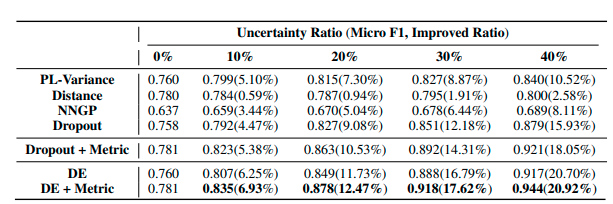
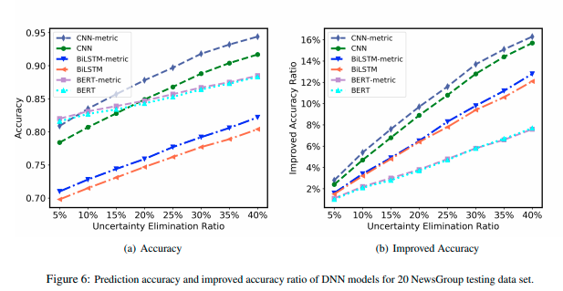
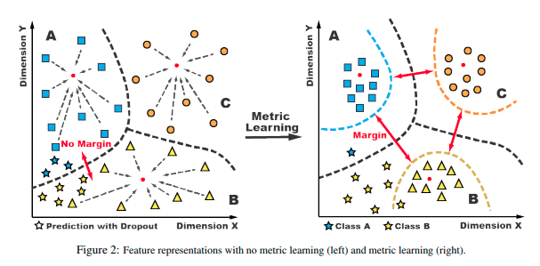

*Paper*: **Mitigating uncertainty in Document Classification**\
*Authors: Xuchao Zhang, Fanglan Chen, Chang-Tien Lu, Naren Ramakrishnan\
Published:* 2019 NAACL 2019*\
Label:* <span id="__DdeLink__104_3718009654"
class="anchor"></span>*Predictive Uncertainty* (WP3)

**Theory** (type of innovation, improving X, task(s) description, uniqueness)
-----------------------------------------------------------------------------

-   Uncertainty estimation designed for text classification with focus
    on improving accuracy in HIL (human in the loop) budget learning.

-   Metric learning, learning distance between feature representations.

-   Dropout-entropy method (with denoising mask operations \[rather
    unclear why/how this works\]).

“our model improved the accuracy from 0.78 to 0.92 when 30% of the most
uncertain predictions were handed over to human experts in “20NewsGroup”
data” → uof 70% met 8%FP? 100 -22\
**2% FP difference with CNN MC dropout. **

{width="6.385416666666667in" height="2.125in"}

Instead of thresholding uncertainty/confidence, they select by X% most
uncertainty (which you cannot know and do at inference time!).

Methodology (support for claims, dataset, evaluation metrics): 
---------------------------------------------------------------

20news dataset, IMDB binary movie reviews, Amazon reviews

Accuracy at %uncertainty reduction → no mention of support at reduced
operating point.\
Report in terms of macro & micro F1, no calibration metrics.\
Compare with more exotic uncertainty estimation works.

B{width="5.5993055555555555in"
height="2.895138888888889in"}est comparison is on the usefulness of
metric learning given different base architectures:

\
**Open-source** material (code, dataset, tutorial, references): 
----------------------------------------------------------------

[*https://github.com/xuczhang/UncertainDC*](https://github.com/xuczhang/UncertainDC)[*\
*]()[*https://vimeo.com/347415373*](https://vimeo.com/347415373)

\
Usefulness\
(task \[classification, extraction, …\], part-of-pipeline, extension / improvement on, domain/use-case):
--------------------------------------------------------------------------------------------------------

**Document** classification

Metric learning is an interesting track to follow; inspired by Conformal
Prediction.

Auxiliary loss function definition is very clear, albeit sloppily
defined in arbitrary mathematical symbols.\
“Feature closeness” and complex classification boundaries are pervasive
phenomena in text classification

{width="6.322916666666667in"
height="3.1145833333333335in"}

**Feasibility\
**(short-term/long-term | nice-to-have, complexity / far-from-practice)
-----------------------------------------------------------------------

Code is available, pytorch, easily readable.\
However, doing this in TF will be more complex as we need access to
features while training, so requires custom training loop.

Questions/Ideas 
----------------

-   Paper on automation formulas and operating points

-   Why is it that BERT does not score better than Glove+CNN (rand) and
    metric learning?

    -   It cannot benefit from the metric learning for which reason?

**BIBtex: **

```

@inproceedings{zhang-etal-2019-mitigating,

title = "Mitigating Uncertainty in Document Classification",

author = "Zhang, Xuchao and

Chen, Fanglan and

Lu, Chang-Tien and

Ramakrishnan, Naren",

booktitle = "Proceedings of the 2019 Conference of the North {A}merican
Chapter of the Association for Computational Linguistics: Human Language
Technologies, Volume 1 (Long and Short Papers)",

month = jun,

year = "2019",

address = "Minneapolis, Minnesota",

publisher = "Association for Computational Linguistics",

url = "https://www.aclweb.org/anthology/N19-1316",

doi = "10.18653/v1/N19-1316",

pages = "3126--3136",

abstract = "The uncertainty measurement of classifiers{'} predictions is
especially important in applications such as medical diagnoses that need
to ensure limited human resources can focus on the most uncertain
predictions returned by machine learning models. However, few existing
uncertainty models attempt to improve overall prediction accuracy where
human resources are involved in the text classification task. In this
paper, we propose a novel neural-network-based model that applies a new
dropout-entropy method for uncertainty measurement. We also design a
metric learning method on feature representations, which can boost the
performance of dropout-based uncertainty methods with smaller prediction
variance in accurate prediction trials. Extensive experiments on
real-world data sets demonstrate that our method can achieve a
considerable improvement in overall prediction accuracy compared to
existing approaches. In particular, our model improved the accuracy from
0.78 to 0.92 when 30{\\%} of the most uncertain predictions were handed
over to human experts in {``}20NewsGroup{''} data.",

}

```
